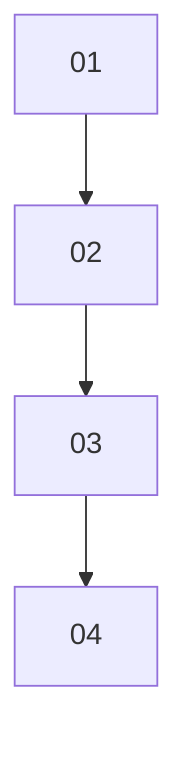

Alpaca XAI Agent

# Trading AI that Gets Smarter Over Time

The End of Black-Box AI Trading: Transparent, Auditable, and Self-Learning.

<u>alpaca-xai-agent.vercel.app</u>

Alpaca XAI Agent

# John Trusted an Automated Bot

He set it to auto-pilot expecting steady profits, but instead of financial freedom, he got continuous losses, zero control, and a red portfolio he can't fix.

| Metric | Value |
| --- | --- |
| Trading Winrate | <40% |

# Alpaca XAI Agent

# IGNORANCE is the PROBLEM

Many AI trading bots lose millions not because the market was unpredictable, BUT because no one knew WHY the bot executed that trade in the first place.

| Time | Open | High | Low | Close |
| --- | --- | --- | --- | --- |
| 10:00 | 976,1200 | 38,030,8850 | 37,930 | 37,980 |
| 11:00 | 38,100,000 | 38,200,000 | 37,800,000 | 37,850,000 |
| 12:00 | 37,900,000 | 38,000,000 | 37,700,000 | 37,750,000 |
| 13:00 | 37,800,000 | 37,900,000 | 37,600,000 | 37,650,000 |
| 14:00 | 37,700,000 | 37,800,000 | 37,500,000 | 37,550,000 |

- $99m
Trade Loss

Alpaca XAI Agent

# Trading Bots Are Dangerous Black Boxes

## Black-Box Execution (Zero Transparency)
Unknown reasoning behind trades. When losses occur, there is no audit trail to hold the AI accountable.

## AI Amnesia (Repeating Mistakes)
Algorithmic bots lacks long-term memory. They repeat identical failed entry triggers over and over.

## Hallucination Risk (Panic Trading)
Unconstrained LLMs are prone to hallucinations and impulsive order executions during high market volatility.

. .
. .
. .
. .

Alpaca XAI Agent

# What If We Make It Learns and Understands?

## Pre-Trade Contract
**Pre-Trade Contract**

Mandatory written hypothesis + Invalidation Triggers before touching the broker API.

## Continuous Audit
**Continuous Audit**

Monitors open positions every 15 minutes to verify if the original thesis remains valid (Hold/Close).

## Post-Mortem Memory
**Post-Mortem Memory**

Stores post-trade lessons in Vector Memory to prevent recurring mistakes and protect trader capital.

Alpaca XAI Agent

# How It Works

. .
. .
. .
. .

. .
. .
. .

| Category | Description |
| --- | --- |
| Bridge Between AI & Institutional Risk Management | Solves the single biggest blocker for AI adoption in finance: **Compliance & Explainability**. |
| Retail Trader Empowerment | Gives individual traders **hedge-fund-level risk management automation** without needing 24/7 screen monitoring |
| Modularity & Scalability | Allows users to **switch** to other brokerage APIs (Binance, Interactive Brokers, Crypto exchanges) **simply** by changing the tool adapter. |

Alpaca XAI Agent

# The New Standard in AI Trading

## Traditional AI Bots
- Black box
- No audit trail
- Mistake amnesia
- Hallucination/manipulation risk.

## XAI Trading Agent
- 100% Explainable
- 15-min Continuous Audit Loop
- Adaptive Vector Memory
- Institutional Guardrails.

Alpaca XAI Agent

# Bridging the Gap Between AI and Trader Trust

Replaces black-box uncertainty with transparent AI and strict guardrails for total trader confidence.

<u>alpaca-xai-agent.vercel.app</u>

<u>https://github.com/ivannov-arch/alpaca-xai-agent</u>

Presentation / 10