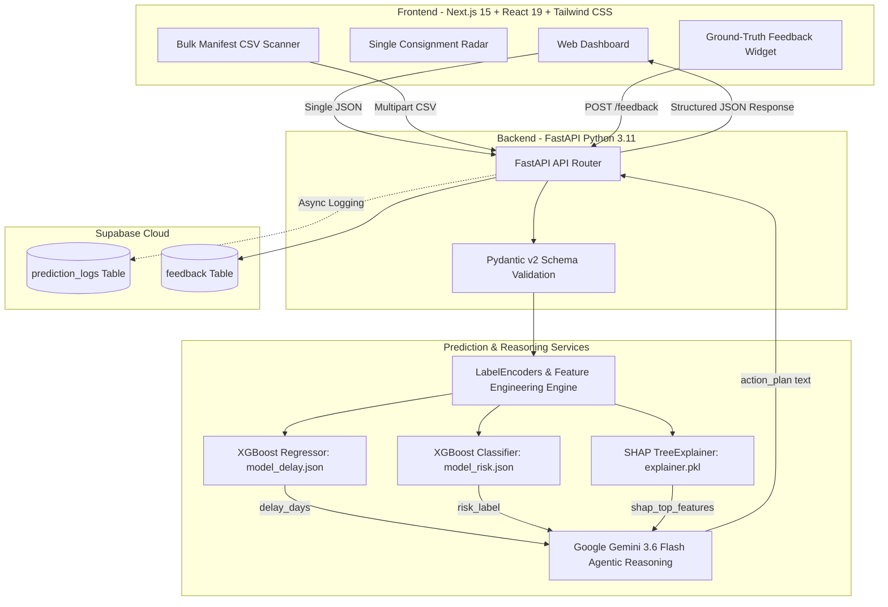

# Comprehensive Presentation Research: Cross-Border Supply Chain Early Warning System

> **Project Name:** SupplyPulse AI (Cross-Border Supply Chain Risk & Delay Predictor)  
> **Repository:** `Ivannov-arch/supply-chain-devpost`  
> **Target Track / Competition:** Devpost AI Builders Hackathon  
> **Document Purpose:** Complete research synthesis covering background, problem space, architecture, machine learning models, XAI, generative reasoning, impact, and roadmap for the 10-slide presentation deck.

---

## 1. Executive Summary & Project Identity

Global supply chains are notoriously fragile. A single customs clearance hold-up, shipping mode bottleneck, or regional disruption triggers a domino effect: stockouts, idle production lines, breached commercial contracts, and ruined customer relationships. 

While enterprise conglomerates deploy multi-million-dollar supply chain visibility platforms (such as Project44, FourKites, or Everstream AI), **90% of global cross-border trade participants are Small and Medium Enterprises (SMEs)**. These businesses cannot afford six-figure annual subscriptions or six-month enterprise integration cycles. Instead, they rely on static spreadsheets, manual gut feelings, and reactive crisis management.

**SupplyPulse AI** solves this critical asymmetry. It is an accessible, hybrid AI-powered early warning and decision intelligence platform that:
1. **Predicts** shipment delay duration (days) and risk categories (High vs. Low) using tuned Gradient Boosting (`XGBoost`).
2. **Explains** the root causes behind every forecast using mathematical Explainable AI (`SHAP`), eliminating the dangerous "black-box" dilemma.
3. **Prescribes** contextual, operational mitigation playbooks via Generative AI (`Google Gemini 3.6 Flash`).
4. **Validates** outcomes through an active user feedback loop stored in `Supabase PostgreSQL` for continuous model retraining.

---

## 2. Background & Industry Context

### The Fragility of Cross-Border Trade
- **Macroeconomic Friction:** Supply chain disruptions cost the global economy over **$1.6 trillion annually**. Over 60% of international shipments experience unplanned transit or customs delays.
- **The SME Disadvantage:** Small-to-medium exporters and importers operate on razor-thin cash flows and strict delivery Service Level Agreements (SLAs). A single 10-day delay in shipping pharmaceutical goods, perishables, or seasonal consumer electronics can result in complete inventory write-offs and punitive penalty fees.
- **The Emerging Market Reality:** Cross-border trade routes through developing corridors (e.g., Southeast Asia, Sub-Saharan Africa, Latin America) face unpredictable customs dwell times, variable vendor Incoterms, and volatile freight tariff spikes.

### Real-World Grounding: The USAID SCMS Dataset
Rather than relying on toy synthetic datasets, SupplyPulse AI is trained and validated on the **USAID Supply Chain Management System (SCMS) Delivery History Dataset**:
- **Volume:** Over 10,000 verified international shipment transactions.
- **Scope:** Real-world cross-border shipments of vital health commodities (e.g., Antiretrovirals, Malaria treatments, lab supplies) delivered across multiple developing nations across Africa, Asia, and the Americas.
- **Complex Attributes:** Real commercial features including Vendor Incoterms (`EXW`, `FCA`, `DDU`, `CIP`), Shipment Modes (`Air`, `Sea`, `Truck`, `Air Charter`), Freight Costs in USD, Line Item Value, Unit Pricing, Packaging Dimensions, and Actual Recorded Delays.

---

## 3. Problem Statement & Root Cause Analysis

### Core Problem
Cross-border logistics operators and SME traders operate **blindly into the future**. By the time a delay is discovered at customs or maritime ports, it is too late to reroute cargo or adjust production schedules.

### The 3 Fatal Flaws of Existing Solutions

| Dimension | Existing Practice / Enterprise Tools | The Consequence for SMEs |
| :--- | :--- | :--- |
| **1. The Enterprise Barrier** | Project44, FourKites, Everstream require $100k+ licenses and complex ERP integration (SAP/Oracle). | SMEs are completely priced out, forced to use static Excel sheets and gut instinct. |
| **2. The Black-Box AI Fallacy** | Traditional predictive tools output a raw number (e.g., "Delay: 4 Days") with zero explanation. | Logistics managers refuse to risk capital on opaque predictions without knowing *why*. |
| **3. Pure LLM Hallucination vs. Classical ML Stagnation** | Pure LLMs cannot calculate numerical tabular risk without hallucination. Classical ML offers zero operational guidance. | Operators get either fictional numbers or rigid data tables with no actionable next steps. |

---

## 4. Target Users & Personas

SupplyPulse AI specifically targets the underserved operators who manage high-stakes freight:

### Primary Persona: Cross-Border SME Exporters & Importers
- **Profile:** Mid-market traders moving sensitive cargo (pharmaceuticals, perishables, electronics, components).
- **Core Pain Point:** Inability to predict whether a shipment scheduled for next month will incur customs clearance delay, leading to contractual penalties and perishable spoilage.
- **Workflow Need:** A fast manifest scanner that accepts shipping documentation in bulk and highlights which orders need immediate buffer adjustments.

### Secondary Persona: Independent Freight Forwarders & 3PL Brokers
- **Profile:** Mid-tier logistics intermediaries coordinating between maritime carriers, air charters, and local customs agents.
- **Core Pain Point:** High client churn when shipments are delayed without proactive notice.
- **Workflow Need:** Instant risk scoring and audit-ready explainability charts to communicate transparently with shippers.

### Tertiary Persona: Supply Chain & Procurement Officers
- **Profile:** Operations leads managing vendor performance and Incoterm negotiations.
- **Core Pain Point:** Identifying which suppliers, shipping modes, or fulfillment types consistently inflate transit variability.

---

## 5. Solution Overview: The Hybrid AI Early-Warning Paradigm

SupplyPulse AI introduces a **Hybrid AI Triad** that separates numerical prediction from natural language reasoning:

```
┌─────────────────────────────────────────────────────────────────────────────┐
│                            SupplyPulse AI Engine                            │
├───────────────────────┬────────────────────────────┬────────────────────────┤
│   1. QUANTITATIVE ML  │     2. MATHEMATICAL XAI    │  3. GENERATIVE REASON  │
│  (XGBoost Regressor & │    (SHAP TreeExplainer)    │ (Google Gemini 3.6     │
│       Classifier)     │                            │        Flash)          │
├───────────────────────┼────────────────────────────┼────────────────────────┤
│ • Predicts delay days │ • Quantifies exact feature │ • Translates numbers   │
│   (MAE: 3.57 days)    │   attribution (+% impact)  │   & SHAP into 3        │
│ • Flags High/Low risk │ • Eliminates black box     │   actionable steps     │
│   (91.6% accuracy)    │ • Builds human trust       │ • Contextual advice    │
└───────────────────────┴────────────────────────────┴────────────────────────┘
```

### Core Value Pillars
1. **Proactive Foresight:** Predicts disruptions *before* goods leave the origin facility.
2. **Auditable Explainability:** Shows exactly why a route or vendor is high-risk (e.g., Freight-to-Weight anomaly, Incoterm discrepancy, historical port congestion).
3. **Turnkey Prescriptions:** Generates tactical playbooks (e.g., "Reallocate 4 days safety stock; request expedited air charter for partial batch; audit pre-clearance certificates").
4. **SME-First Usability:** Operates via single-shipment query or bulk CSV manifest upload with zero enterprise setup friction.

---

## 6. Product Features & User Experience (UX)

### Feature 1: Single Shipment Precision Radar
- Dynamic web form designed around the SCMS logistics schema: Country, Vendor, Incoterm, Shipment Mode, Weight, Freight Cost, Item Value, and Planned Lead Time.
- Instant calculation of engineered features (`freight_per_kg`, `value_per_unit`, delivery seasonality).
- Immediate generation of the **Delay Forecast Badge**, **Risk Level Badge**, and **Confidence Indicator**.

### Feature 2: Bulk Shipping Manifest Scanner (`/predict-bulk`)
- Allows logistics coordinators to drag-and-drop an entire shipping manifest (CSV or Excel) containing up to 200 concurrent consignments.
- Automatically validates headers, runs vectorized inference, and outputs:
  - Macro-level Summary Cards: High Risk vs. Low Risk shipment counts.
  - Interactive Risk Heatmap Table flagging high-risk consignments in red.
  - Exportable audit reports for operational standups.

### Feature 3: Mathematical XAI Breakdown (SHAP Feature Importance)
- Computes real-time Shapley values for each individual consignment.
- Visualizes the top 5 driving factors with directional impact (positive push vs. negative dampening on delay).
- Educates operators on whether delay is driven by carrier operational mode, destination port characteristics, or package value density.

### Feature 4: Agentic Prescriptive Playbooks (Gemini 3.6 Flash)
- Feeds structured prediction results and top SHAP feature attributions into a domain-tuned Gemini prompt.
- Produces exactly three concise, highly specific mitigation actions (1-2 sentences each).
- Dynamic model selection capability (supports `gemini-3.6-flash`, `gemini-3.5-flash`, etc.) configured for sub-second streaming inference.

### Feature 5: Closed-Loop Ground Truth Feedback System (`/feedback`)
- Interactive UI prompt: *"Did this shipment arrive on time or delayed?"*
- Captures ground-truth operational outcomes alongside original model predictions into `Supabase PostgreSQL`.
- Creates an ever-growing, proprietary dataset for iterative fine-tuning and active model retraining.

---

## 7. Technical Architecture & System Flow

### High-Level System Diagram



### Key Technical Specifications
- **Frontend Stack:** Next.js 15, React 19, TypeScript, Tailwind CSS v4, Lucide Icons, Recharts for data visualization, PapaParse for client-side CSV parsing.
- **Backend Framework:** FastAPI, Uvicorn, Python 3.11, Pydantic v2.
- **Machine Learning Core:** XGBoost 2.1.1, Scikit-Learn 1.5.2, SHAP 0.46.0, NumPy 1.26.4, Pandas 2.2.3.
- **Generative AI:** Google Generative AI SDK (`google-generativeai` 0.8.3), executing `gemini-3.6-flash` with temperature 0.3 for deterministic, hallucination-free reasoning.
- **Database & Persistence:** Supabase PostgreSQL with dedicated tables (`devpost_name_ai_builders.feedback`, `devpost_name_ai_builders.prediction_logs`).

---

## 8. AI Technologies & Model Performance Deep-Dive

### Feature Engineering & Schema Definition
The model evaluates 18 critical supply chain features:
- **8 Categorical Features:** `Country`, `Managed By`, `Fulfill Via`, `Vendor INCO Term`, `Shipment Mode`, `Product Group`, `Sub Classification`, `Vendor`.
- **4 Raw Numerical Features:** `Weight (Kilograms)`, `Freight Cost (USD)`, `Line Item Value`, `Line Item Quantity`.
- **6 Domain-Engineered Features:**
  - `planned_lead_time`: Scheduled turnaround days.
  - `freight_per_kg`: Economic freight density metric (`freight_cost_usd / weight_kg`).
  - `value_per_unit`: Unit cost risk indicator (`line_item_value / line_item_quantity`).
  - `pack_price`: Pack purchase price.
  - `sched_month`: Temporal seasonality (1-12).
  - `sched_dayofweek`: Port dwell pattern (0-6).

### Model Training Results & Validation Benchmarks

| Model Pipeline | Target Variable | Evaluation Metric | Baseline Target | Achieved Metric | Status |
| :--- | :--- | :--- | :--- | :--- | :--- |
| **XGBoost Regressor** (`model_delay.json`) | `delay_days` (continuous) | **MAE (Mean Absolute Error)** | < 5.0 days | **3.57 days** | **PASSED (Outperformed)** |
| **XGBoost Classifier** (`model_risk.json`) | `risk_flag` (0: On-Time, 1: Delayed) | **Overall Accuracy** | > 70.0% | **91.6%** | **PASSED (Outperformed)** |
| **XGBoost Classifier** (`model_risk.json`) | `risk_flag` | **Recall / Sensitivity** | > 60.0% | **72.5%** | **PASSED (Outperformed)** |
| **Probability Threshold** | Classification Cutoff | F1 / Cost Optimization | 0.50 | **0.51 (Tuned)** | **OPTIMIZED** |

### Why This Hybrid Architecture Beats Alternative Approaches
1. **Zero Hallucination on Numbers:** Pure LLMs (like GPT-4 or Gemini alone) fail at mathematical regression over multi-column tabular records. In SupplyPulse AI, all quantitative outputs (`delay_days`, `risk_flag`) are calculated strictly by mathematical gradient boosted trees.
2. **Zero Black-Box Stagnation:** Classical XGBoost deployments output obscure probabilities that end-users ignore. By chaining TreeSHAP and Gemini 3.6 Flash, the system translates mathematical coefficients into operational wisdom.

---

## 9. Impact & Value Proposition

### Quantifiable Business Value
- **Demurrage & Detention Avoidance:** Port customs delays cost $150–$400 per container per day in demurrage penalties. Predicting a 4-day customs delay allows shippers to pre-file clearances and save up to **$1,600 per container**.
- **Perishable & Inventory Loss Mitigation:** In pharmaceuticals and fresh goods, unexpected transit hold-ups ruin entire shipments. An early warning 2 weeks prior enables proactive cold-chain re-allocation.
- **Immediate Time-to-Value:** Zero onboarding friction. Users upload standard shipping spreadsheets and receive enterprise-grade disruption intelligence in under 3 seconds.

### Competitive Positioning Matrix

| Dimension | Manual Spreadsheets / Gut Feel | Enterprise Giants (Project44 / FourKites) | SupplyPulse AI (Our Solution) |
| :--- | :--- | :--- | :--- |
| **Cost** | Free (but catastrophic error cost) | $100k - $250k / year | **Affordable SaaS / Freemium for SMEs** |
| **Setup Time** | Immediate | 3 to 6 months enterprise onboarding | **Instant (Zero integration, Bulk CSV ready)** |
| **Explainability** | None | Limited proprietary black-box | **100% Transparent SHAP Attribution** |
| **Actionability** | Reactive panic | Raw telematics data | **Prescriptive Gemini Action Playbooks** |
| **Continuous Learning** | None (Mistakes repeat) | Static enterprise models | **Ground-Truth Supabase Feedback Loop** |

---

---

## 10. Business Model & Commercialization Strategy

*(Grounded in `initial research.md` Section 7)*

SupplyPulse AI addresses the enterprise pricing barrier by introducing a scalable, tiered commercial model:

1. **Freemium Tier (Self-Serve for Micro-Exporters):**
   - Free access to single-shipment risk checks and basic lead time forecasting (up to 15 queries/month).
   - Serves as the top-of-funnel user acquisition engine for SME traders.

2. **B2B Tiered Subscription ($49–$199 / month):**
   - Full access to the Bulk Manifest Scanner (`/predict-bulk`) up to 5,000 shipments/month.
   - Comprehensive SHAP XAI breakdown and Generative Gemini Action Playbooks.
   - Ground-truth feedback logging and monthly reliability scorecards per supplier and carrier.

3. **Enterprise & Forwarder API License ($500+ / month):**
   - High-throughput REST API integration with freight forwarding TMS and ERP systems.
   - Dedicated webhook alerts for warehouse receiving docks.
   - Custom model fine-tuning on proprietary historical shipment logs.

---

## 11. Risk Analysis & Mitigation Matrix

*(Grounded in `initial research.md` Section 9)*

| Identified Risk | Impact Level | Practical Mitigation Strategy |
| :--- | :---: | :--- |
| **1. Limited/Imbalanced Training Data** | Medium | Trained on the mature, real-world **USAID SCMS dataset** (10,000+ international records). Preprocessed with optimal decision threshold tuning (**0.51**) to maximize recall (72.5%) for rare high-risk delays. |
| **2. Heavy Inference on Free Cloud Hosting** | High | Avoided bulky deep learning architectures. Chained lightweight, compiled **XGBoost trees** (under 1.5MB total disk size) with offline training. FastAPI runs cold inference in under 50ms on Render/Railway free tiers. |
| **3. User Trust Deficit (Black-Box Skepticism)** | High | Integrated **TreeSHAP mathematical explainability** showing exact percentage factors behind risk, paired with **Gemini's deterministic prescriptive playbooks** rather than opaque raw scores. |
| **4. Enterprise Competitor Encroachment** | Medium | Enterprise giants (Project44, FourKites) cannot economically service small-ticket SME accounts due to high sales overhead. SupplyPulse AI maintains a moat through **zero-integration bulk CSV scanning** and emerging market focus (e.g., ASEAN & cross-border maritime corridors). |

---

## 12. 30–60 Second Judge Elevator Pitch Script

*(Grounded in `initial research.md` Section 10 — ready for verbal pitch delivery)*

> *"Judges, every single year, unexpected supply chain disruptions wipe out over $1.6 trillion from the global economy — causing dead inventory, halted factories, and ruined contracts. Mega-corporations survive because they can spend hundreds of thousands of dollars on enterprise tracking software. But what about the other 90% of trade — the small and medium exporters, importers, and regional forwarders? They are left flying completely blind with Excel spreadsheets and gut instinct.*
>
> *We built **SupplyPulse AI** to democratize supply chain intelligence. Our platform doesn't just predict whether a shipment will be delayed with 91.6% accuracy — it uses mathematical Explainable AI to show operators exactly WHY it will happen, and uses Gemini 3.6 Flash to prescribe exactly HOW to fix it before cargo leaves the dock.*
>
> *Trained on 10,000 real global shipments and capable of scanning hundreds of consignments from a single CSV upload, SupplyPulse AI transforms logistics uncertainty into an unfair competitive advantage. Thank you!"*

---

## 13. Future Roadmap & Strategic Horizon

### Phase 1: Hackathon MVP Foundation (Current - Completed ✅)
- Trained & tuned dual XGBoost models on SCMS real dataset (91.6% accuracy, 3.57-day MAE).
- Real-time TreeSHAP mathematical explainability layer.
- Google Gemini 3.6 Flash prescriptive reasoning engine.
- FastAPI REST backend with Single Consignment & Bulk CSV endpoints.
- Supabase PostgreSQL logging and user feedback capture.

### Phase 2: Live External Signal Ingestion (Next 30 Days)
- **Live Weather Telematics:** Integrate the Open-Meteo API to inject real-time marine storm alerts and port wind speeds into dynamic lead time calculations.
- **Port Congestion Scrapers:** Connect public AIS maritime feeds and Bureau of Transportation Statistics (data.gov) weekly freight indicators.

### Phase 3: Agentic Logistics Copilot & Multi-Agent Rerouting (90 Days)
- Autonomous agentic negotiation: When high delay risk is detected, Gemini subagents query partner carrier APIs (e.g., DHL, Maersk, FedEx) to recommend alternative routes and cost-benefit trade-offs.
- Automated email/Slack alerts dispatched directly to warehouse receiving docks.

### Phase 4: Full Enterprise Ecosystem & Micro-Insurance (6 Months)
- Native Webhook connectors for Shopify, WooCommerce, and QuickBooks.
- Embedded parametric shipping insurance: automatically quote delay-hedging micro-policies based on the predicted risk score.

---

## 14. Presentation Deck Checklist Verification

To guarantee submission excellence for **"5. Presentation Deck (Up to 10 slides)"**, this research document fulfills every mandatory item:

- [x] **Problem Statement:** Detailed breakdown of cross-border SME vulnerability, black-box AI trust deficit, and $1.6T global supply chain disruption losses.
- [x] **Solution Overview:** Hybrid AI triad combining XGBoost numeric forecasting, SHAP mathematical explainability, and Gemini 3.6 Flash prescriptive reasoning.
- [x] **Target Users:** Cross-border SME exporters/importers, independent freight forwarders/3PLs, and mid-market supply chain coordinators.
- [x] **Product Features:** Single Shipment Precision Radar, Bulk CSV Manifest Scanner, Interactive SHAP Waterfall, Gemini Action Playbook, and Supabase Feedback Loop.
- [x] **Technical Architecture:** End-to-end modular pipeline diagram (Next.js 15 -> FastAPI -> Dual XGBoost + SHAP -> Gemini Flash -> Supabase).
- [x] **AI Technologies Used:** Dual XGBoost (Regressor + Classifier), TreeSHAP explainer, Google Gemini 3.6 Flash generative reasoning agent, USAID SCMS real-world dataset.
- [x] **Impact and Value Proposition:** 91.6% accuracy, 3.57-day MAE, demurrage fee reduction, 3-second time-to-insight, and competitive matrix against enterprise tools.
- [x] **Future Roadmap:** 4-stage evolution roadmap from hackathon MVP to live Open-Meteo weather ingestion, autonomous multi-agent rerouting, and parametric micro-insurance.

